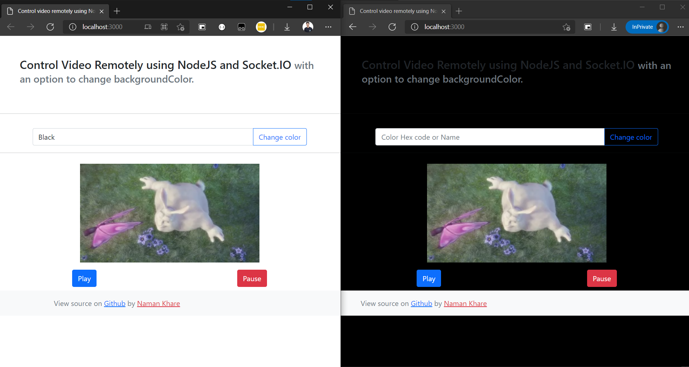
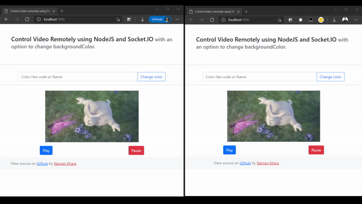

# Control Video Remotely using NodeJS and Socket.IO

## Description
Control Video Remotely using NodeJS and Socket.IO with an option to change background Color as well.

## Example
### Image: 


### Gif: 


## Installation 
* Run ```npm install``` inside the terminal to install the node mmodules.
* Change the video file inside the ```public``` folder.
* Replace File path inside the index.js
* ```npm start``` to run.
